# 👋 Hello, I'm **Ishan**

  

  

  

---

## 🧐 About Me

I'm passionate about blending **technology** and **creativity**—using code, visual effects, and animation to craft unforgettable experiences. Whether it's building games, animating worlds, or editing cinematic videos, I love pushing boundaries at the intersection of **art** and **engineering**.

- 🔥 **Current Focus:** Game development, AI-driven art, interactive UI/UX
- 🎯 **Mission:** Creating immersive digital experiences that *delight and inspire*
- 🌱 **Learning:** Advanced AI/ML, Unreal Engine, Real-time VFX
- 💬 **Ask me about:** Java, Python, VFX, Animation, Game Development
- ⚡ **Fun Fact:** I love combining coding with art—think generative visuals and interactive experiences!

---

## 🛠️ Tech Stack & Skills

### 💻 Programming Languages

)

### 🎨 Creative Software

### 🔧 Tools & Platforms

---

## 📊 GitHub Analytics

  
  

  

  

---

## 🚀 Featured Projects

| 🎮 **Game Development** | 🎨 **Creative Projects** | 💻 **Development Tools** |
|:---:|:---:|:---:|
| [**Pac-Man AI**](https://github.com/IshanG2111) | [**VFX Short Film**](https://github.com/IshanG2111) | [**Multi-User System**](https://github.com/IshanG2111/MultiUser) |
| Smart ghost AI & hint system | 3D animation & visual effects | Collaborative platform |
| `Java` `AI` `Game Logic` | `Blender` `After Effects` | `Java` `Multi-threading` |

### 📌 Repository Highlights

  
  

---

## 🌱 Current Learning Journey

```mermaid
graph LR
    A[🤖 AI & ML] --> B[Generative Art]
    C[🎮 Game Dev] --> D[Unreal Engine]
    E[🎬 VFX] --> F[Real-time Effects]
    G[🌐 Web Tech] --> H[Interactive UI]
    
    B --> I[Creative Coding]
    D --> I
    F --> I
    H --> I
    
    I --> J[🚀 Next Project]
```

- 🤖 **AI & Machine Learning:** Exploring generative art and ML-powered creativity
- 🎮 **Advanced Game Development:** Building interactive experiences with Unreal Engine
- 🎬 **Real-time VFX:** Procedural animation and live visual effects
- 🌐 **Modern Web Technologies:** React, Three.js, and interactive web experiences

---

## 🎯 GitHub Activity

  

---

## 🤝 Let's Connect!

---

   <em><b>I love connecting with different people</b> so if you want to say <b>hi, I'll be happy to meet you more!</b> 😊</em>

---

  
### ⭐ Don't forget to star repositories you find interesting!

**Thank you for visiting my profile!** 🙏

*"Code is like humor. When you have to explain it, it's bad."* – Cory House

---

  

